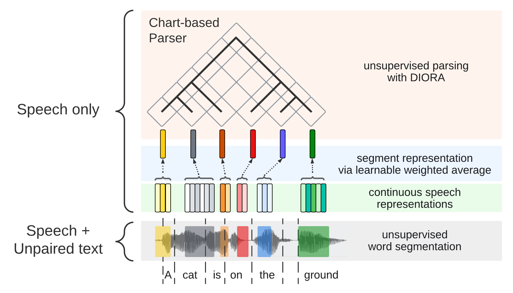

## Unsupervised Spoken Constituency Parsing

Official repo for our ICASSP 2023 paper: [Cascading and Direct Approaches to Unsupervised Constituency Parsing on Spoken Sentences](https://arxiv.org/abs/2303.08809), which investigates two approaches to unsupervised constituency parsing on spoken sentences, given 1) raw speech & 2) unlabeled text. 

<p align="center">
</p>

If you use this code for research, please cite our paper as follows:
```
@inproceedings{tseng2023parsing,
  title={Cascading and Direct Approaches to Unsupervised Constituency Parsing on Spoken Sentences},
  author={Tseng, Yuan and Lai, Cheng-I and Lee, Hung-yi},,
  booktitle={ICASSP 2023 - 2023 IEEE International Conference on Acoustics, Speech and Signal Processing (ICASSP)},
  year={2023},
}
```

The paper is available on arXiv: https://arxiv.org/abs/2303.08809

For questions/concerns/bugs please contact r11942082 at ntu.edu.tw

## Preprocessing

See `pytorch/diora/speech/README.md`

## Training & Evaluation 

(TBA)

## Attribution

This repo is modified from [DIORA](https://github.com/iesl/diora). Original README for DIORA can be found in README_old.md)
